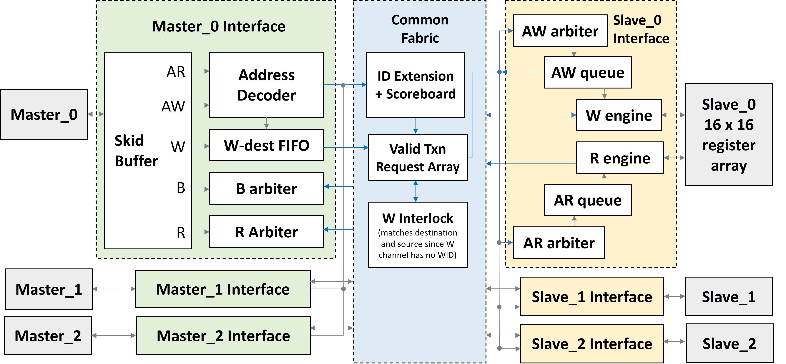
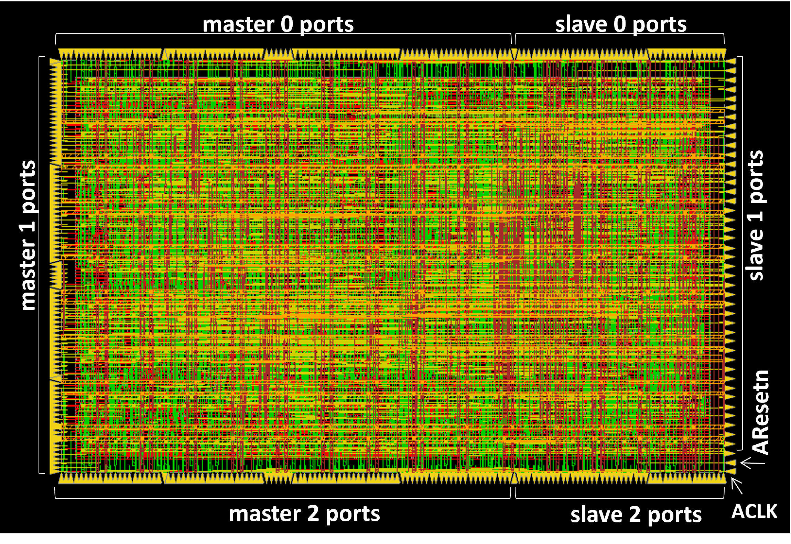
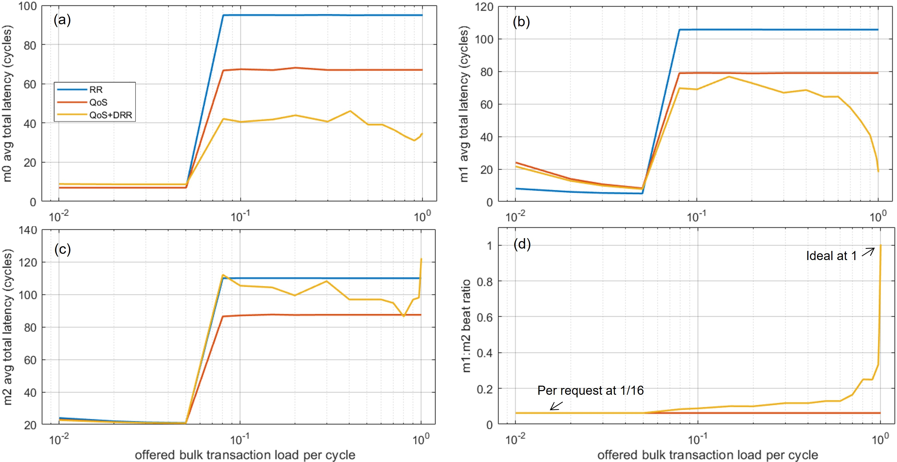
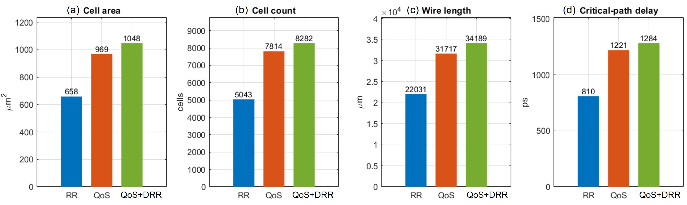
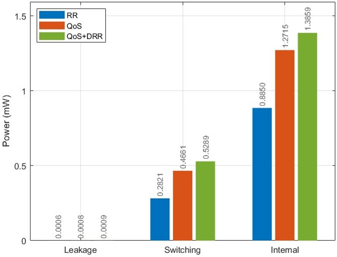

# QoS-Aware DRR Arbitration for a 3×3 AXI4 Crossbar

Three arbitration architectures for an AMBA AXI4 crossbar: round robin, QoS priority with anti-starvation aging, and QoS-aware deficit round robin taken through a full RTL-to-GDSII flow on the ASAP7 7-nm predictive PDK. The AXI4 spec fixes ordering and carries a 4-bit QoS field but leaves the service policy open; this project builds the policy and measures silicon cost.

**Paper:** *Priority-Aware Deficit Round Robin for AXI4 Bandwidth Fairness in ASAP-7nm Process*.

**Role (first author):** the crossbar architecture and SystemVerilog RTL for all three policies, the TCL-scripted RTL-to-GDSII flow on ASAP7, the traffic generator and simulation, and the post-route analysis.

## Results

Post-route on ASAP7 at 500 MHz, all three built behind the same port list and driven by the same traffic:

- Under a **1:16 burst-length mismatch**, round robin and QoS both hold two equal-weight masters at a **1:16** beat ratio. QoS+DRR raises it to **1:1 at full load** (0.084 at 8% → 0.25 → 0.50 → 1.00 at 99–100%).
- Priority-master read latency: **95 cycles (RR) → 67 (QoS) → 37 (QoS+DRR)** at 500 MHz: **190 ns → 74 ns**.
- Single-beat bulk-master latency drops **83%** at full load (105 → 18 cycles).
- The cost of QoS+DRR over RR: **+390 µm² cell area, +0.75 mW, +51% critical-path delay**. Over QoS: **+79 µm², +0.18 mW**. Area, wire, and delay track the added scheduling logic at constant per-instance cell size.

## Architecture

A 3-master × 3-slave AXI4 crossbar across the five channels (AW, AR, W, B, R), with a per-master interface, a shared common fabric, and a per-slave interface. The three policies differ only inside the arbiters and the read queue; everything else is identical.

- **Master interface:** skid buffers on all five channels; an address decoder that produces a target-slave select or a `DECERR` for unmapped or boundary-crossing bursts; every ID widened with an originating-master tag for the return path.
- **Common fabric:** an ID-extension scoreboard that permits one outstanding transaction per ID, so any reordering the fabric does is protocol-legal. A masters×slaves eligibility grid feeds the arbiters. Since W beats carry no ID, a W-interlock matches each master's W-destination FIFO against the slave's AW-queue head to forward one master's burst at a time.
- **Slave interface:** a per-slave arbiter admits one master; independent read and write engines back a small 16×16 register array, kept minimal so the measurement reflects fabric cost, not memory-macro area.

The three policies as scheduling hooks (`Eligible` / `Pick` / `OnGrant`):

- **Round robin:** everyone eligible, first from the round-robin pointer, no state. Fair per grant, so long bursts take proportionally more bandwidth.
- **QoS + aging:** pick highest AxQOS; a starved master's priority is raised to max after a wait limit. Orders latency but leaves bandwidth share untouched.
- **QoS + DRR:** each grant costs `len+1` beats against a per-master deficit; a master is eligible only while its deficit covers the cost, refreshed by a per-round quantum. Priority (per-transaction AxQOS) and bandwidth share (per-master weight) stay as separate controls, and bursts are never split, so address-channel occupancy and row-buffer locality are preserved. No aging counters needed.

## Traffic simulation

The traffic is on-chip SoC interconnect traffic, generated in RTL rather than from a trace. It models the contention case where a latency-critical master shares a slave with bulk data engines: **m0** is the latency-sensitive client (short 4-beat bursts, `ARQOS=15`, low rate — a CPU cache-miss or sensor interface), while **m1** and **m2** are the bulk pair (equal weight, `ARQOS=0`) differing only in burst length — m1 single-beat, m2 16-beat, the 16× disparity that separates per-request from per-beat fairness (m2 stands in for a DMA or accelerator engine).

Load is injected by a per-master Bresenham credit accumulator, so the offered load is bit-identical across all three RTL trees regardless of what the fabric does downstream. Two profiles are swept from 1% to 100%: a **latency** profile (m0 fixed, bulk pair swept) and a **fairness** profile (m0 silent, m1:m2 beat ratio alone).

## Method

Each policy is a separate RTL tree with identical top-level ports, taken through RTL-to-GDSII on ASAP7 with TCL-scripted synthesis, floorplan (60% utilization, masters left / slaves right), power mesh, place-and-route, CTS, and signoff in Cadence. Constraints are held identical across all three physical runs (500 MHz, TT, 0.7 V), so every difference in area, power, timing, and wire length reflects the scheduling logic alone. The `tcl/` folder holds the flow scripts.

## Images

**Crossbar microarchitecture**

  

**Routed layout**

  

**Traffic simulation: latency and bandwidth fairness**

  

**Post-route PPA and power**

  
  

